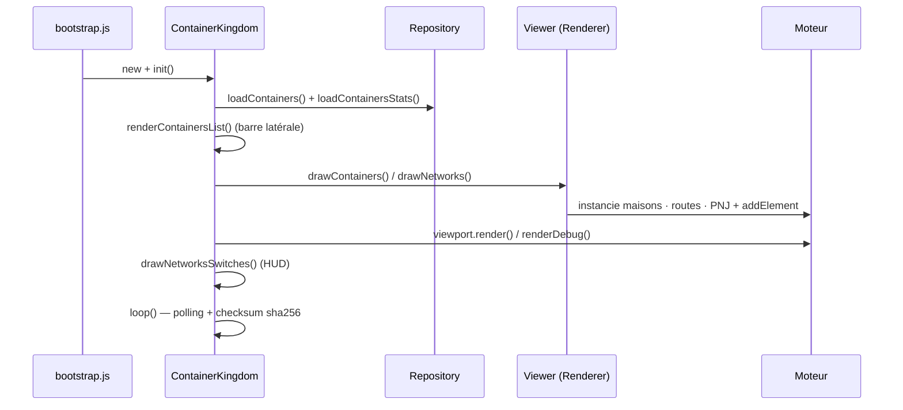

# Container Kingdom (l'application)

L'app transforme l'état d'un daemon Docker en une carte RPG : chaque **conteneur**
devient une **maison**, chaque **réseau** devient un tracé de **routes**, et des
**PNJ** peuplent la scène. Elle *utilise* le moteur (`src/engine/`) mais ne le
modifie jamais — elle instancie ses éléments et les ajoute au board via l'API
publique.

Tout est sous `src/container-kingdom/js/`.

## Démarrage

`index.html` charge `bootstrap.js` (module ES) qui, au `DOMContentLoaded` :

```
applyDebugFlag()                 # ?debug=1 → body.debug
new DockerApiClient()
new ContainerKingdom(dockerApiClient)
instance.zoom(0.5)
```

## Orchestration : `ContainerKingdom`

`ContainerKingdom.init()` enchaîne le pipeline (async) :



La **boucle de polling** (`loop`) recharge périodiquement l'état Docker et calcule
un checksum `sha256` ; elle ne redessine que si l'état a **changé** — même idée
« ne travailler que sur changement » que le streaming du moteur.

## Données : de Docker à l'écran

- **`DockerApiClient`** — appelle `/api/docker/*`. En prod, nginx proxifie ces
  routes vers la socket Docker ; en dev, un **plugin Vite les mocke** (voir
  [development.md](development.md)).
- **`ContainerRepository`** — charge conteneurs et stats, les tient en mémoire ;
  le renderer/layout/HUD interrogent l'app (`getContainers()`, …).
- **`DockerCompose`** — regroupe les conteneurs par **projet compose** (les stacks
  `dc-*` de la barre latérale).
- **`Container`** — le modèle d'un conteneur (métier / vue séparés).

## Placement : `ContainerPlacement`

Où poser chaque maison ? Une **grille d'occupation déterministe** : `ContainerPlacement`
maintient une grille de cellules et expose `getClosestFreeCoords(x, y, minDistance)`
qui renvoie la cellule libre la plus proche d'un point de départ. Déterministe et
**testé unitairement** (`test/ContainerPlacement.test.js`) — indépendant du rendu.

## Rendu : `ContainerKingdomRenderer`

Le « viewer » dessine sur une **grille de cellules** (`cellWidth`) :

- **`drawContainers()`** — pour chaque conteneur, trouve une cellule libre via
  `ContainerPlacement`, y instancie une **maison** (élément moteur) étiquetée
  (nom, mémoire) et lui associe un **PNJ** (une base `Woman00/01/02` / `Man00`
  choisie par index) ; les auras colorées reflètent le statut/CPU.
- **`drawNetworks()`** — relie par des tuiles de **route** les maisons partageant
  un même réseau Docker.

Interaction : cliquer un PNJ ouvre une **bulle** (`quickReaction`) avec un lien
vers l'URL de démo du conteneur, le cas échéant.

## Layout & HUD

- **`ContainerKingdomLayout`** — crée l'`Application` du moteur, **enregistre les
  classes d'éléments par nom** (`registerElement('House00', House00)`, …) pour
  l'instanciation par nom, câble `map.update`, et gère la structure de page.
- **`KingdomHud`** — l'overlay : usage mémoire/CPU agrégé et **interrupteurs de
  réseaux** (afficher/masquer un réseau).
- **`ContainersList` / `ContainersListEntry`** — la barre latérale listant les
  stacks et leurs conteneurs.
- **`Log` / `LogEntry`**, **`sha256`** — utilitaires (journal, checksum du polling).

## Frontière avec le moteur

L'app **consomme** le moteur, jamais l'inverse. Concrètement : elle importe depuis
`../../engine/index.js`, instancie des éléments moteur (`new House00()`,
`new Man00()`), les ajoute aux `Area`s, écoute les events moteur
(`element.click`, `element.trigger`…). Ajouter un nouveau *type* d'élément visuel
se fait **côté moteur** (voir [engine.md](engine.md)), puis l'app l'enregistre et
l'instancie.
