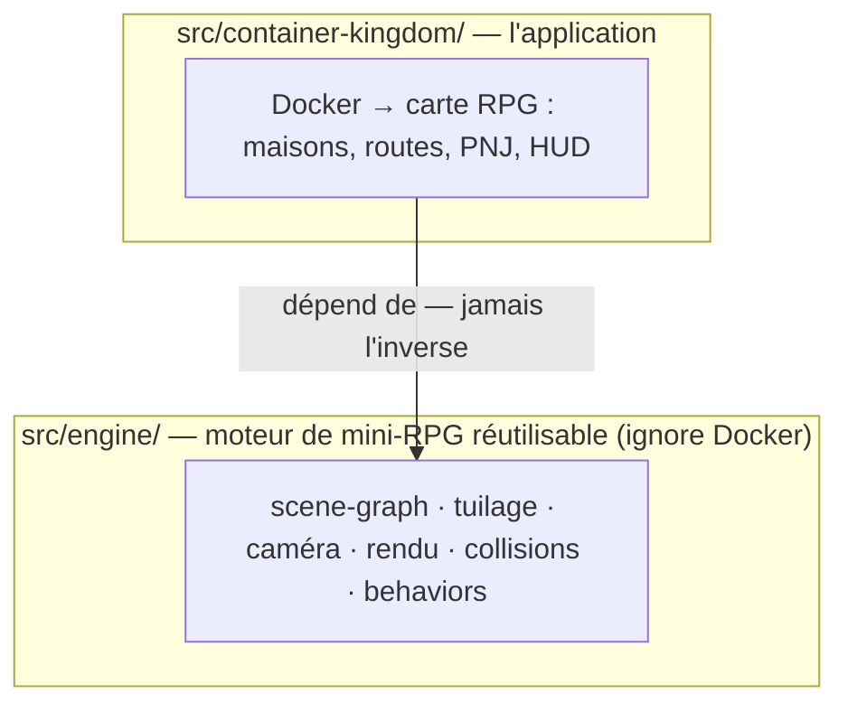
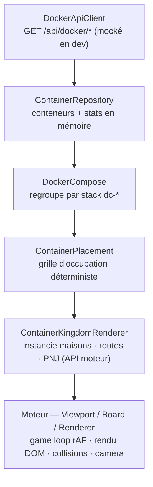
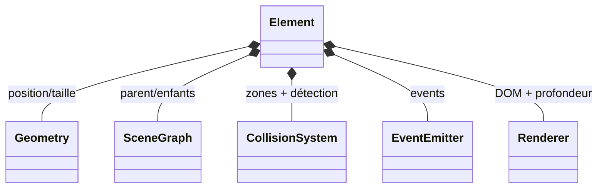

# Architecture

Container Kingdom est fait de **deux couches nettement séparées** :



La règle d'or : **les dépendances vont de l'app vers le moteur, uniquement**.
Le moteur n'importe rien de `container-kingdom/`, et tout ce qu'un hôte
consomme passe par le baril `src/engine/index.js`. Le moteur peut être embarqué
dans un autre projet sans toucher une ligne de Container Kingdom (c'est ce que
fait la démo `src/engine/demo/`).

## Flux de données de l'app



En parallèle : `KingdomHud` (mémoire/CPU, interrupteurs de réseaux),
`ContainersList` (barre latérale des stacks/conteneurs), et une **boucle de
polling** (`ContainerKingdom.loop`) qui recharge périodiquement l'état Docker.
Le rendu n'est relancé que si cet état a changé (détection par checksum
`sha256`).

## Le moteur en bref

Le cœur est **`Element`** : un nœud du graphe de scène qui **compose** des
sous-systèmes dédiés plutôt que de tout faire lui-même.

| Sous-système     | Responsabilité                                            |
|------------------|-----------------------------------------------------------|
| `Geometry`       | position/taille locales                                   |
| `SceneGraph`     | parent/enfants, offsets absolus, lookup par nom          |
| `CollisionSystem`| zones collision/trigger, broad+narrow phase, événements   |
| `EventEmitter`   | events locaux qui remontent à l'`Application`            |
| `Renderer`       | nœud DOM, position monde, profondeur (algorithme du peintre) |



Au-dessus : `Board` (grille d'`Area`s tuilées, **streamées 7×7** autour du
joueur), `Viewport` (game loop rAF, registre de behaviors, déplacement du joueur
— entrées déléguées à `DirectionalInput`), `Camera` (suit une cible, découplée
du personnage), et les
`Renderer/*` spécialisés (area, board, character, sprite).

Les personnages (`Character`) sont des `Element`s animés. Leur IA est déléguée
à des **behaviors** interchangeables (`PatrolBehavior`, `FleeBehavior`,
`CharacterBehavior`), tickés par la game loop.

Détails : **[engine.md](engine.md)**. Détails app : **[container-kingdom.md](container-kingdom.md)**.

## Où vit quoi

```
src/
  index.html                 point d'entrée de l'app (charge bootstrap.js)
  engine/
    index.js                 baril d'exports — unique surface publique du moteur
    map/                     Element + sous-systèmes, Board/Area, Viewport/Camera…
      Elements/              éléments intégrés (maisons, arbres, clôtures, PNJ…)
        Flowers/             la planche flowers-00 : 219 éléments de décor
      Renderer/              renderers spécialisés
    Renderer? (non) ; css/, images/   styles et sprite-sheets du moteur
    demo/                    vitrine autonome du moteur (`/engine/demo/`)
    debug.js                 flag ?debug=1 → classe body.debug
  container-kingdom/
    js/                      l'app (voir container-kingdom.md)
    css/                     styles de l'app
mock/                        mock de l'API Docker (dev + tests)
test/                        suite Vitest
documentation/               ce dossier
```
