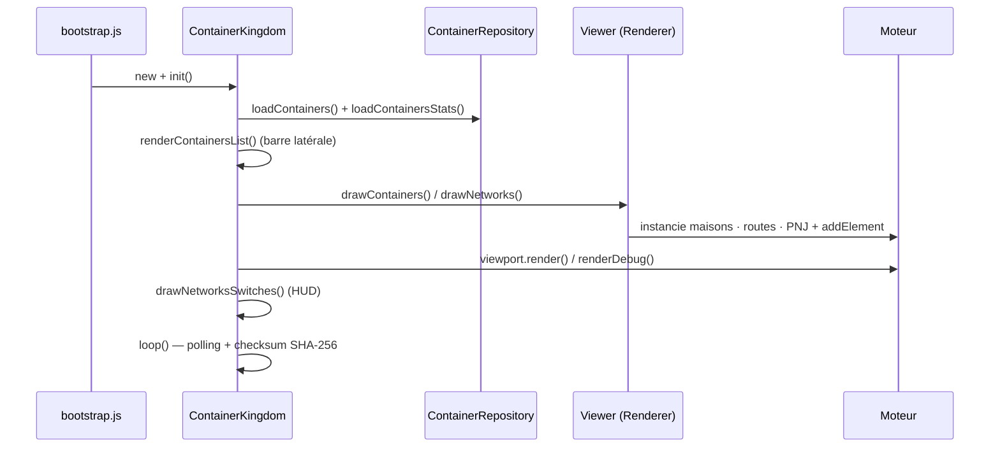

# Container Kingdom (l'application)

L'app transforme l'état d'un daemon Docker en une carte RPG : chaque **conteneur**
devient une **maison**, chaque **réseau** devient un tracé de **routes**, et des
**PNJ** peuplent la scène. Elle *utilise* le moteur (`src/engine/`) mais ne le
modifie jamais : elle instancie ses éléments et les ajoute au board via l'API
publique.

Tout est sous `src/container-kingdom/js/`.

## Démarrage

`index.html` charge `bootstrap.js` (module ES) qui, au `DOMContentLoaded` :

```
applyDebugFlag()                 // ?debug=1 -> body.debug
new DockerApiClient()
new ContainerKingdom(dockerApiClient)
instance.zoom(0.5)
```

## Orchestration : `ContainerKingdom`

`ContainerKingdom.init()` enchaîne le pipeline (async) :



La **boucle de polling** (`loop`) recharge périodiquement l'état Docker et stats,
avec un `try/catch/finally` qui garantit le réarmement du tick même en cas
d'erreur transitoire côté daemon Docker.

Quand l'empreinte change, `ContainerKingdom.refreshKingdom()` **réconcilie la carte
en place** — plus aucun `location.reload()` : le zoom, le déplacement et la console
ouverte survivent. Le renderer rend sa cellule au placement pour un conteneur
disparu, dessine la maison d'un nouveau venu, puis **retrace la couche réseau en
bloc** (le tracé des routes est une fonction globale de la topologie). Un point
d'attention : les éléments ajoutés après le démarrage vivent dans le graphe de
scène **sans DOM** tant que le viewport n'a pas été rendu — d'où le `render()` qui
suit la réconciliation.

Un changement d'**état** (`running` → `exited`) n'a même pas besoin de cette
détection : `ContainerView.refresh()` remet la classe `state--*` de la maison à
chaque cycle de stats.

La détection de changement ne vit qu'à un seul endroit :
`ContainerRepository.loadContainers()` calcule un checksum `SHA-256` normalisé
(ID, image, **état**, réseaux, labels) et déclenche le callback explicite
`onContainersChanged` quand l'empreinte varie.

Le champ `Status` de l'API Docker est **volontairement exclu** de l'empreinte :
c'est le libellé lisible par un humain (`"Up 4 seconds"`, `"Up About a minute"`),
qui **vieillit tout seul** — l'inclure faisait signaler un changement à presque
chaque tick, et donc recharger la page en boucle. `State` (`running`, `exited`,
`paused`…) porte la même information de façon stable.

## Données : de Docker à l'écran

- **`DockerApiClient`** — appelle `/api/docker/*`. En prod, nginx proxifie ces
  routes vers la socket Docker ; en dev, un **plugin Vite les mocke** (voir
  [development.md](development.md)).
- **`ContainerRepository`** — charge conteneurs et stats, les tient en mémoire ;
  le renderer, le layout et le HUD interrogent l'app (`getContainers()`, …).
- **`DockerCompose`** — regroupe les conteneurs par **projet compose** (les stacks
  `dc-*` de la barre latérale).
- **`Container`** — le modèle d'un conteneur (métier / vue séparés).

## Placement : `ContainerPlacement`

Où poser chaque maison ? Une **grille d'occupation déterministe** : `ContainerPlacement`
maintient une grille de cellules et expose `getClosestFreeCoords(x, y, minDistance)`
qui renvoie la cellule libre la plus proche d'un point de départ. Ce placement est
**déterministe** et **testé unitairement** (`test/ContainerPlacement.test.js`),
indépendamment du rendu.

## Rendu : `ContainerKingdomRenderer`

Le renderer dessine sur une **grille de cellules** (`cellWidth`) :

- **`drawContainers()`** — pour chaque conteneur, trouve une cellule libre via
  `ContainerPlacement`, y instancie une **maison** (élément moteur) étiquetée
  (nom, mémoire) et lui associe un **PNJ** (une base de personnage choisie dans
  le pool public du moteur, aujourd'hui les 8 variantes de `characters-00.png`) ;
  les auras colorées reflètent le statut/CPU.
- **`drawNetworks()`** — relie par des tuiles de **route** les maisons partageant
  un même réseau Docker.

Interaction : cliquer un PNJ ouvre une **bulle** (`quickReaction`) avec un lien
vers l'URL de démo du conteneur, le cas échéant.

## Layout & HUD

- **`ContainerKingdomLayout`** — crée l'`Application` du moteur, **enregistre les
  classes d'éléments par nom** (`registerElement('House00', House00)`, …) pour
  l'instanciation par nom, branche `map.update`, et gère la structure de page.
- **`KingdomHud`** — l'overlay : usage mémoire/CPU agrégé et **interrupteurs de
  réseaux** (afficher/masquer un réseau).
- **`ContainersList` / `ContainersListEntry`** — la barre latérale listant les
  stacks et leurs conteneurs.
- **`Log` / `LogEntry`**, **`sha256`** — utilitaires (journal, checksum du polling).

## Frontière avec le moteur

L'app **consomme** le moteur, jamais l'inverse. Concrètement : elle importe depuis
`../../engine/index.js`, instancie des éléments moteur (`new House00()`,
`new Man00()`, `new Man04()`), les ajoute aux `Area`s, écoute les événements moteur
(`element.click`, `element.trigger`…). Ajouter un nouveau *type* d'élément visuel
se fait **côté moteur** (voir [engine.md](engine.md)), puis l'app l'enregistre et
l'instancie.
