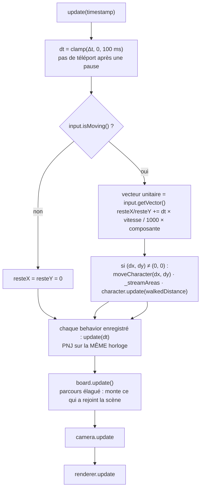
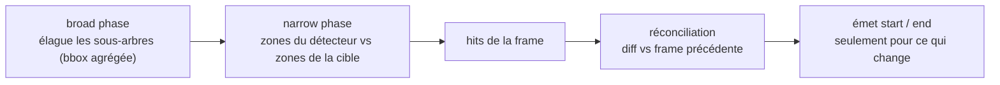
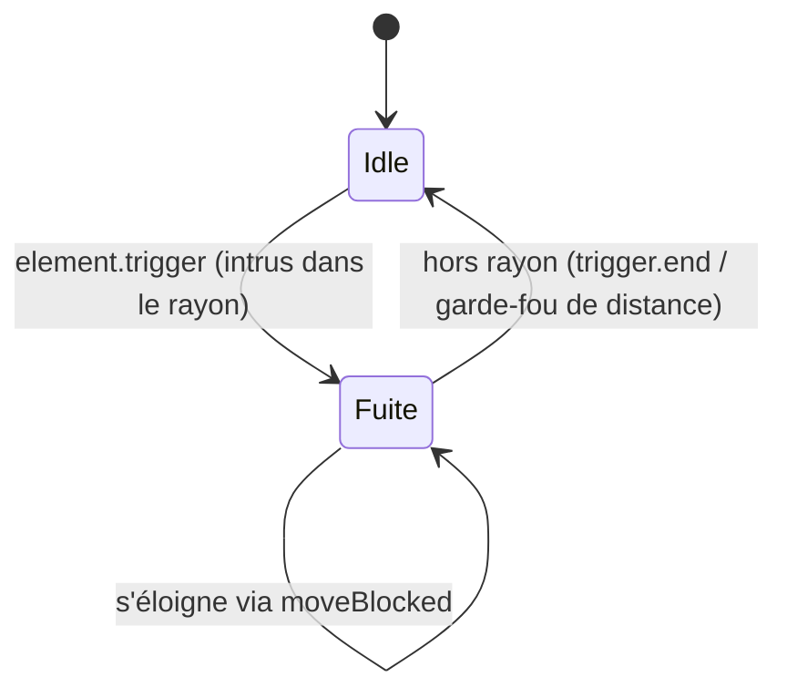

# Le moteur de mini-RPG

Un moteur **vanilla JS, sans framework**, qui rend une carte tuilée façon RPG
dans un conteneur DOM : board défilable, éléments positionnés, personnages
animés, collisions, événements. Il ne connaît **rien** de l'app qui l'embarque.

> Usage rapide, frontière et configuration des chemins d'assets :
> voir **[`src/engine/README.md`](../../src/engine/README.md)**. Ce document-ci
> décrit les **concepts internes**. Le détail au niveau code est dans les
> **JSDoc** (exhaustifs) de chaque fichier.

Le catalogue moteur (`/engine/catalog/`) propose désormais une navigation par
familles (index cliquable), des filtres combinables (texte/type/zones), un tri,
et un état partageable dans l'URL (`q`, `kind`, `zone`, `sort`).

## 0. Où vivent les choses

L'arborescence est découpée **par responsabilité**, et le **contenu est sorti du
noyau** — un jeu bâti sur ce moteur doit pouvoir ignorer le village.

| Dossier | Ce qu'il porte |
|---|---|
| `Application.js` | le point d'entrée, à la racine avec le baril `index.js` |
| `scene/` | `Element` et ce qui le compose : `SceneGraph`, `CollisionSystem`, `Geometry`, `Coordinates`, `BoundingBox`, `SpriteElement` |
| `world/` | `Board`, `Area` — le tuilage et son streaming |
| `view/` | `Viewport` (la game loop), `ViewportTransform`, `Camera`, `DirectionalInput` |
| `character/` | `Character`, `CharacterAnimator` et les behaviors interchangeables |
| `render/` | les renderers DOM (élément, sprite, board, area, personnage) |
| `events/` | le bus : `EventEmitter`, `EngineEvents` (§9) |
| `fx/` | particules, émetteurs, surfaces canvas (§3.2) |
| `content/` | les éléments intégrés : décors, sprites, bases de personnages |
| `catalog/`, `tools/`, `demo/` | outillage et vitrines, hors moteur proprement dit |

Ces dossiers remplacent un `map/` unique qui portait 19 fichiers à plat — dont
l'`Application`, la boucle de jeu et les personnages, qui ne parlaient pas de
carte. **Seuls `Board` et `Area` l'étaient vraiment**, et ce sont eux qui ont
gardé le rôle sous le nom `world/`.

## 1. Scene graph : `Element` et ses sous-systèmes

`Element` est le nœud de base de l'arbre de scène. Plutôt qu'une god-class, il
**compose** des sous-systèmes ; ses méthodes publiques sont de fines façades
au-dessus d'eux :

- **`Geometry`** — `x/y/width/height` **locaux** (relatifs au parent).
- **`SceneGraph`** — enfants, parent, `getChildByName`, et les **offsets absolus**
  (`offsetX/offsetY` = position dans le monde, en accumulant la chaîne de parents).
- **`CollisionSystem`** — zones de collision/trigger, bounding boxes, détection.
- **`EventEmitter`** (`events/`) — événements locaux, qui **remontent** ensuite à
  l'`Application` ; abonnements révocables, buckets copy-on-write. Noms déclarés
  dans `EngineEvents` — voir §9.
- **`Renderer`** — le nœud DOM et sa mise à jour visuelle.

Coordonnées : **locales** (`x()`, `y()`) vs **monde** (`offsetX()`, `offsetY()`).
La collision et la profondeur raisonnent en coordonnées monde.

## 2. Board, Area et streaming

- **`Area`** — une tuile de carte (taille du viewport) contenant des éléments en
  coordonnées locales.
- **`Board`** — la grille d'`Area`s (un `Element` lui-même).

Pour ne pas charger une carte infinie, le `Viewport` **streame** les areas : il
ne garde qu'une fenêtre **7×7** autour du joueur. Le streaming est **paresseux et
event-driven** : il ne fait un travail que lorsque le joueur **change d'area**
(`_streamAreas` compare aux coords d'area précédentes) — marcher à l'intérieur
d'une area ne coûte rien. Chargement en 7×7, libération au-delà d'un anneau
(hystérésis, pour ne pas thrash sur une frontière).

Quand une area est libérée, elle est désormais **détruite** (`destroy`) : elle
est retirée du scene-graph du board, son rendu est détaché du DOM, puis la
matrice `board.areas` est nettoyée. Le board recalcule aussi ses bounding boxes
agrégées après retrait d'enfants : elles ne grossissent donc plus indéfiniment
au fil du streaming (coût collision et update bornés par la fenêtre active).

## 3. Viewport : la game loop

Le `Viewport` porte la **boucle de jeu** (une seule, sur `requestAnimationFrame`) :



Points clés :

- **Une seule horloge.** Joueur et PNJ sont tickés par la même game loop avec le
  même `dt` (les behaviors s'enregistrent via `viewport.addBehavior`). Pas de
  `setTimeout` maison.
- **Le monde se pose avant d'être peint** — `board.update()` chaque frame. C'est
  ce parcours, et lui seul, qui **monte ce qui a rejoint la scène** : une area
  streamée, une entité apparue en cours de partie. Attacher un élément suffit ;
  l'hôte n'a rien à appeler. Voir §3.4 pour le drapeau qui l'élague.
- **Le sous-pixel est mis en banque, pas jeté — un reste par axe.** Le déplacement
  se fait en pixels entiers (les sprites pixel-art ne doivent pas atterrir sur un
  demi-pixel), mais la fraction restante est **reportée sur la frame suivante**.
  Arrondir chaque frame isolément liait la vitesse de marche à la fréquence
  d'écran — et sous un pixel par frame (écran rapide ou personnage lent) chaque
  frame arrondissait à zéro : le personnage ne partait **jamais**. La banque se
  remet à zéro à l'arrêt, pour qu'un reste dormant ne ressorte pas en saut au pas
  suivant. Chaque axe a **sa** banque, alimentée par sa composante du vecteur
  **unitaire** : c'est ce qui normalise la diagonale (0,7071 par axe) sans second
  arrondi.
- **Les entrées vivent dans `DirectionalInput`**, pas dans le `Viewport` (voir
  §3.1) : la boucle lui demande seulement « ça bouge ? » et « dans quelle
  direction ? ».
- **rAF est en pause quand l'onglet est caché** → tout gèle (voir
  [development.md](development.md) pour tester en pilotage manuel).

### 3.1 `DirectionalInput` : les touches enfoncées

Le `Viewport` ne retient plus **une** direction mais l'**ensemble des directions
tenues, dans l'ordre d'appui** — c'est ce qui rend les diagonales possibles et ce
qui supprime l'« arrêt fantôme » (relâcher une touche quelconque stoppait le
personnage, même une flèche encore enfoncée).

`DirectionalInput` **ignore le DOM et les touches** : le `Viewport` traduit
`ArrowUp` → `'up'` (table `Viewport.KEY_DIRECTIONS`) et l'alimente. Une autre
source d'entrée (D-pad, manette) s'y branche de la même façon, et le sous-système
se teste sans jsdom.

| Question | Réponse |
|---|---|
| `isMoving()` | y a-t-il un déplacement ? Deux directions **opposées s'annulent** : quelque chose est enfoncé, rien ne bouge. |
| `getVector()` | le vecteur **unitaire** du déplacement — la diagonale vaut (±0,7071, ±0,7071), pas (±1, ±1). |
| `getFacing()` | la direction du sprite = **la dernière touche encore tenue**. Relâcher la plus récente **revient** à la précédente sans cas particulier. |

Côté `Viewport` : `press(direction)` / `release(direction)` ajoutent et retirent
une direction, `move(direction)` n'en tient qu'**une** (tout le reste relâché) et
`stop()` relâche tout. Un arrêt **ne change pas** l'orientation : un personnage
immobile regarde toujours quelque part.

**Collision et diagonale** : `moveCharacter(dx, dy)` tente le vecteur complet,
puis l'axe horizontal seul, puis le vertical (« slide along wall »). Sans cette
dégradation, marcher en biais contre un mur bloque **tout** le déplacement au lieu
de longer le mur.

### 3.2 `fx/` : particules et émetteurs

Le rendu DOM est le bon choix pour des sprites persistants et collidables, le
mauvais pour des **centaines d'objets éphémères**. Les particules vivent donc sur
un `<canvas>`, monté par `viewport.enableParticles()`.

Tout le sous-système vit dans **`src/engine/fx/`** — il n'a rien à voir avec la
carte. C'était le premier dossier extrait de l'ancien `map/`, avant que celui-ci
n'éclate (§0).

- **Deux objets, deux rôles.** `ParticleSystem` est **pur** — il naît, vieillit
  et meurt au rythme du `dt`, sans rien connaître du DOM (donc testable sans
  jsdom, comme `DirectionalInput`). `ParticleLayer` est le seul à toucher un
  contexte 2d.
- **Monde à l'écriture, écran au dessin.** Les émetteurs parlent en coordonnées
  monde comme le reste du moteur ; le layer **délègue la matrice** à la
  `ViewportTransform` (§3.3), qui porte décalage, échelle et ratio de pixels. Le
  canvas garde la **taille du viewport**, jamais celle du monde chargé.
- **`FX_DEPTH`, et pourquoi il faut y penser.** Le canvas est un **frère du
  board** — mais cela ne suffit pas : le board est un `Element` comme un autre,
  donc il porte sa propre profondeur calculée (mesurée à **1 000 560**) et peint
  *par-dessus* un frère laissé à `z-index: auto`. Les particules étaient
  dessinées, correctes… et invisibles. La surface est donc élevée à `FX_DEPTH`
  (10 000 000), avec l'invariant que rien n'atteint jamais cette profondeur en
  monde.
- **Le repos ne coûte rien.** Zéro particule vivante ⇒ pas même un `clearRect`,
  exactement comme la transformation caméra qui n'est pas réécrite à l'arrêt. Le
  `devicePixelRatio` est **plafonné à 2**, et la particule est un sprite
  pré-rendu (pas un `arc()` par particule et par frame).
- **Écriture seule.** Rien dans le moteur ne relit ce layer : ni collision, ni
  clic, ni état de jeu. Un effet qui doit devenir collidable redevient un
  `Element` du scene-graph. C'est cette règle qui garde le second paradigme de
  rendu bon marché.

#### Deux surfaces : `above` et `ground`

Un effet de sol (poussière, ombre, onde) doit passer **derrière** ce qui se
trouve devant ; un jet d'eau, lui, monte au-dessus du bassin. D'où deux surfaces,
choisies par effet dans le descripteur (`layer: 'ground' | 'above'`, `above` par
défaut).

Pourquoi ce n'est pas qu'une affaire de z-index : le board **porte un z-index**
(mesuré à 1 000 560), donc il crée un contexte d'empilement. Un canvas frère est
soit au-dessus de toute la carte, soit sous son herbe — jamais entre les deux.
S'intercaler exige d'être **enfant du board**, dans le créneau libre entre l'herbe
(`auto`) et les éléments (`DEPTH_BASE + offsetY + height`) : c'est
`GROUND_FX_DEPTH`.

Étant dans le board, la surface au sol **subit sa transformation CSS**. Elle est
donc posée en coordonnées **monde** — origine au point qui tombe à l'écran en
(0, 0), taille = viewport ÷ échelle — et repositionnée seulement **quand la vue
bouge**. Heureuse conséquence : `applyToContext` sert les deux surfaces sans
changement, cette origine étant exactement celle que la transformation attend.

Sa mémoire vaut **viewport × devicePixelRatio**, indépendamment du zoom : la
taille CSS suivant l'inverse de l'échelle, la densité reste constante (mesuré à
1,5 device pixel par pixel écran aux échelles 0,5, 1 et 2).

**Un seul `ParticleSystem` alimente les deux** — le budget reste un plafond
global, et chaque particule porte le nom de sa surface. Corollaire à ne pas
manquer : le système est vieilli **une seule fois par frame**, par le `Viewport`
et non par chaque surface, sans quoi chaque durée de vie serait divisée par deux.

#### Les émetteurs sont des behaviors

Un effet ne porte pas de minuterie : c'est un **behavior**, enregistré par
`viewport.addBehavior(...)`, qui reçoit le `dt` de l'horloge unique — au même
titre que `PatrolBehavior`. Il gèle et repart avec le jeu.

`Emitter` tient la cadence et la **cible**, qui est soit un point monde fixe
(`at`), soit un **élément qui bouge** (`follow`, duck-typé sur
`offsetX()`/`offsetY()`), avec un `offset` pour viser les pieds plutôt que le coin
haut-gauche. Après un long gel (onglet en arrière-plan), le retard n'est **pas
rejoué** : une frame à 10 s produit une salve, pas cent.

Les effets nommés sont **déclaratifs**, comme le `static descriptor` d'un
`SpriteElement` — la donnée d'un côté, le comportement de l'autre :

```js
viewport.addBehavior(new FountainSpray(fx, { at: { x: 224, y: 438 } }));
viewport.addBehavior(new FootstepDust(fx, {
  follow: character, offset: { x: 24, y: 44 },
  isMoving: () => viewport.getInput().isMoving(),
}));
```

`shouldEmit()` est le point de surcharge : c'est ainsi que la poussière ne se
lève que sous un personnage qui marche, sans que la classe de base connaisse quoi
que ce soit aux personnages.

#### Un élément porte son effet

Mieux que de poser un émetteur à la main : un élément **déclare** le sien dans son
descripteur, en coordonnées **locales**, exactement comme sa zone de collision et
son ombre.

```js
static descriptor = {
  width: 80, height: 64,
  collision: [4, 5, 70, 59],
  fx: [{ emitter: FountainSpray, at: { x: 24, y: 8 } }],   // local, jamais monde
};
```

Posez dix fontaines : chacune crache depuis son propre bassin, sans une ligne
côté hôte.

L'élément **ne va pas chercher** la surface FX — le scene-graph dépendrait d'un
rendu. C'est `FxBinder` qui lit les déclarations et câble, sur appel **explicite
et idempotent** : `enableParticles()` lie ce qui existe, `_streamAreas` relie
après chargement, un hôte qui ajoute des éléments plus tard rappelle `bind`. Ce
choix vient de deux faits : aucun événement d'attachement n'existe (et en émettre
un lèverait pour les 414 éléments que le catalogue construit sans application), et
`_streamAreas` ne tourne jamais dans un hôte sans personnage.

**Deux ceintures contre la fuite.** `Element.destroy()` détache et ne prévient
personne : `Board.freeArea` délie donc avant de détruire, **et** un émetteur dont
la cible n'a plus de parent s'arrête de lui-même. C'est la famille de défaut qui
avait déjà mordu `freeArea` (`2026-07-26_14-18`) ; ici elle produirait des gouttes
jaillissant d'un mort.

**Le culling n'est pas du confort** : le budget de particules est partagé et
plafonné, donc les gouttes hors écran **évincent les visibles**. Un émetteur hors
champ se tait, avec une marge de **128 px monde** — une goutte vit 1,2 s à
90 px/s, soit ~108 px de trajet, et couper au ras du bord empêcherait une
particule née juste dehors d'entrer dans le cadre.

### 3.3 `ViewportTransform` : le propriétaire unique de monde ↔ écran

La carte est dessinée une fois, puis **déplacée en bloc** : elle défile par
translation, elle zoome par mise à l'échelle. Cette relation appartient à un seul
objet.

Avant lui, elle était écrite à deux endroits avec deux modèles — le moteur
translatait selon la caméra, l'hôte translatait **et** mettait à l'échelle — et
tout ce qui devait s'aligner sur la carte devait deviner dans quel régime il
tournait. Le layer de particules s'est trompé : il suivait la caméra et ignorait
le zoom de l'app.

**Convention** : la transformation stocke la **translation CSS appliquée au
board**. Une caméra en `(cx, cy)` alimente donc `offset = (-cx, -cy)` ; un hôte
qui pane de `(px, py)` alimente `offset = (px, py)`. Avec
`transform-origin: 0 0` :

```
écran = monde × échelle + décalage
monde = (écran − décalage) / échelle
```

| Question | Réponse |
|---|---|
| `worldToScreenX/Y`, `screenToWorldX/Y` | scalaires, **sans allocation** — la boucle de dessin les appelle par particule |
| `toCssTransform()` | la chaîne que porte le board ; le terme `scale()` est **toujours** émis, les gestes de l'hôte y sont épinglés |
| `applyToContext(ctx)` | la matrice d'un canvas, ratio de pixels compris — appliqué **une seule fois** |
| `clone()` | un état figé, pour un geste qui doit convertir contre l'instant où les doigts se sont posés |

- **Deux sources, un propriétaire.** `Camera.isActive()` ne dit plus « qui possède
  la transformation » mais « la caméra l'alimente-t-elle ». Un hôte qui pilote son
  propre pan/zoom écrit dans la **même** transformation et laisse la caméra au
  repos.
- **Aucun arrondi ici.** Le pan est fractionnaire en pratique ; arrondir ferait
  vibrer la carte au zoom fractionnaire. Le placement au pixel entier reste sur
  les positions d'éléments (`Coordinates`).
- **`transform-origin: 0 0` n'est pas cosmétique** : toute l'arithmétique de pan
  suppose que l'échelle grandit depuis le coin haut-gauche.

### 3.4 Le pipeline de redessin : un drapeau qui monte, un parcours qui descend

`Element.needUpdate` est le drapeau « il y a quelque chose à repeindre ici ».

- **Le lever monte.** `needUpdate(true)` marque tout le chemin jusqu'à la racine.
  C'est ce qui rend le parcours **élagable** : un nœud non marqué n'a rien de sale
  en dessous, la descente s'arrête là.
- **L'éteindre ne monte pas.** `needUpdate(false)` ne vaut que **pour soi**. Un
  nœud ne parle pas au nom de ses ancêtres — quand il le faisait, un enfant qui
  terminait sa mise à jour éteignait son parent, et un frère qui venait de
  demander un redessin n'était **plus jamais visité**.
- **Le drapeau est éteint avant le travail, pas après.** Ce qui est marqué
  *pendant* la passe appartient à la frame suivante ; éteindre après aurait effacé
  la demande à l'instant où elle était levée.

`Viewport.update()` fait descendre ce parcours **à chaque frame**, entre les
behaviors et la caméra. Avant, il n'avait lieu qu'au franchissement d'une area :
attacher un élément levait un drapeau que rien ne lisait, et l'élément restait
invisible jusqu'à ce que le joueur change de tuile par hasard.

Mesuré sur la démo (313 éléments rendus, 63 areas), le 2026-08-02 :

| Scénario | `Element.update()` / frame | Balayage du board / frame |
|---|---|---|
| monde immobile | 3,4 | 0,01 |
| joueur en marche | 2,5 | 0,03 |
| marche + collisions | 12,1 | 0,13 |

Autrement dit : quelques nœuds sur 376, jamais l'arbre entier — l'élagage porte
tout le coût. Le personnage principal reste peint **exactement une fois par
frame** (150 frames mesurées, pire cas 1) : il se repeint lui-même en marchant,
et le parcours ne repasse pas derrière lui.

## 4. Camera

`Camera` est un objet de première classe qui **suit une cible** (`follow(target)`)
et se centre dessus en espace monde. Elle est **découplée** du personnage : le
joueur se déplace dans le monde, la caméra le suit — ce qui évite le couplage
« caméra bindée en dur au personnage » qui posait problème historiquement.

## 5. Rendu et profondeur (algorithme du peintre)

Chaque `Renderer.render()` synchronise taille / position / profondeur du nœud DOM
avec le modèle, en **n'écrivant que ce qui a changé** (caches `_lastLeft`, etc.).

La **profondeur** (z-index) suit l'algorithme du peintre en espace monde :

```
z = DEPTH_BASE + offsetY() + height()
```

- `offsetY + height` trie par le **bas** de l'élément (ce qui est plus « devant »
  passe au-dessus), de façon cohérente entre areas (la caméra n'affecte jamais z).
- `DEPTH_BASE` (grande constante positive) garde le z **au-dessus du sol** même au
  nord de l'origine, où `offsetY` devient négatif (sinon l'élément passe derrière
  l'herbe, qui est le background des areas à z ≈ 0).

## 6. Collisions

Le `CollisionSystem` fait du **broad + narrow phase** et sépare **détection** et
**réconciliation** :

- **Broad phase** — élague tout sous-arbre dont la bounding box agrégée ne
  recoupe pas (pruning). Cet agrégat borne **les zones de collision et de trigger**
  — les siennes et celles de ses enfants — et **jamais le rectangle de l'élément** :
  un élément sans zone ne contribue rien, et son agrégat reste *indéfini* (coins
  `null`), donc inoffensif. Cette sémantique vaut par les **deux** chemins qui
  construisent la boîte : la croissance incrémentale (ajout de zone / d'enfant) et
  le recalcul après détachement d'un enfant.
- **Narrow phase** — teste les **vraies zones de collision du détecteur** (son
  « corps ») contre les zones de la cible. ⚠️ *À ne pas confondre avec l'agrégat* :
  l'agrégat inclut aussi les zones trigger, donc l'utiliser en narrow phase ferait
  « collisionner » un perso à grand rayon trigger avec tout ce qui l'entoure
  (bug corrigé — la narrow phase utilise les zones, l'agrégat reste pour le broad).
- **Détection** (`_detect`/`_hitZones`) — pure : renvoie les hits, sans events.
- **Réconciliation** (`_reconcile`) — diffe les hits vs la frame précédente et
  n'émet que les events qui changent : `element.collision` / `.collision.end`
  (et pareil pour `trigger`). Pas de « clear » de tout l'arbre à chaque frame.



Deux types de zones :

- **collision** — solides : bloquent le déplacement.
- **trigger** — capteurs : émettent `element.trigger` / `.trigger.end` sans bloquer.

### Passe unique collision + trigger

Le joueur détecte les deux en **une seule traversée** :
`detectCollisionAndTrigger(board)` réconcilie la collision et renvoie les triggers
bruts, que le `Viewport` réconcilie **à la position finale** (après un éventuel
revert de collision) — pour qu'un trigger collé à un mur ne se déclenche pas quand
on tape ce mur. `overlaps(element)` est une variante **pure** (booléen, sans
events), pour une IA qui sonde son déplacement.

### La primitive de déplacement

`Character.moveBlocked(dx, dy, isBlocked)` bouge puis **annule** si le prédicat
`isBlocked()` signale une collision. Le joueur et les behaviors NPC la partagent,
chacun avec sa propre politique de collision.

## 7. Personnages et behaviors

`Character` (un `Element` animé) ne porte **pas** d'IA : elle est déléguée à un
**behavior** interchangeable, tické par la game loop (`update(dt)` qui accumule
le temps et rejoue un pas à la cadence voulue) :

- **`PatrolBehavior`** — allers-retours sur un axe, inverse à distance atteinte
  **ou** sur collision.
- **`FleeBehavior`** — crée une **zone trigger** (rayon de détection) ; quand
  quelque chose y entre (event `element.trigger`), le PNJ fuit à l'opposé.
- **`CharacterBehavior`** — errance aléatoire.

Exemple, le cycle de `FleeBehavior` (entièrement piloté par le trigger) :



L'animation est isolée dans **`CharacterAnimator`** (cycle de marche piloté par
la distance parcourue, donc indépendant du framerate), et la **bulle de
dialogue** passe par le renderer :
`character.quickReaction(html)`, `clearQuickReaction()`, `isReacting()`, plus les
events `element.reaction.show` / `element.reaction.hide`.

## 8. Éléments déclaratifs

Les éléments intégrés (maisons, arbres, clôtures, fleurs, PNJ) sont des
**`SpriteElement`** décrits par un `static descriptor` (atlas, frame, zones de
collision/trigger, `manualZ`) — pas de code de rendu à écrire. Les PNJ
(`CharacterBases/`) sont des `Character` avec un offset de sprite-sheet. Le
moteur expose aujourd'hui les 8 bases présentes sur `images/characters/characters-00.png`.

### Planche `flowers-00` (219 éléments)

`images/map/flowers-00.png` est une grille régulière de **16×16 cellules de
32 px**. Ses 219 sprites (fleurs, champignons, feuillages, nénuphars, champs,
puits, souche, troncs, dalles, rochers) vivent sous
`content/Flowers/`, découpés par thème (`Blossoms`, `Clusters`, `Fields`,
`Foliage`, `Mushrooms`, `Props`, `Water`) et ré-exportés en bloc par
`Flowers/index.js` puis par le baril du moteur.

Comme la planche est régulière, chaque élément tient en **une ligne** : le helper
`cell(col, row, extra?)` de `Flowers/atlas.js` dérive tout le descripteur de la
position de la cellule.

```js
export class LilyPad00 extends SpriteElement { static descriptor = cell(8, 0); }
export class Well00 extends SpriteElement { static descriptor = cell(2, 8, { collision: [3, 14, 26, 16] }); }
export class FlowerField00 extends SpriteElement { static descriptor = cell(14, 9, SPAN_2X2); }
```

Conventions de la planche :

- **Nommage** `<Famille><NN>`, l'index suivant l'ordre de lecture de l'atlas
  (29 familles : `Blossom`, `Mushroom`, `LilyPad`, `FlowerField`…). Les teintes ne
  sont pas dans les noms — le [catalogue](http://localhost:5173/engine/catalog/)
  les montre.
- **Ombres** : l'art porte sa propre ombre peinte → `shadow: false` partout, sauf
  `Flower00` (antérieur à cette passe, descripteur figé).
- **Zones** : rien par défaut ; `collision` uniquement sur ce qui bloque
  (`Well00`, `Stump00/01`, `HollowLog00..02`, `Rock00..03`), `manualZ` sur les
  sols (`FlowerGrass*`, `FlowerPatch*`, `StoneSlab00`).
- `test/flowers-00.test.js` verrouille la découpe (alignement 32 px, bornes
  512×512, aucune cellule découpée deux fois) et ces conventions.

### Planche `map-sprites-01` (lot arbres autonomes)

`images/map/map-sprites-01.png` mélange objets posables et fragments
d'assemblage (autotiles, coins, bandes de façade, morceaux de routes/arches).
Le moteur n'ayant pas de tuilage automatique, le lot public retient seulement
les sprites autonomes, nommables et posables tels quels.

Premier lot exposé sous `content/MapSprites01/` :

- `Conifer00..35`
- `LeafTree00..26`
- `CanopyTree00..23`
- `TallTree00..29`
- `DeadTree00..24`
- `SaplingTree00..05`

Soit **148 éléments** issus de la planche, tous exportés via `index.js`.

Conventions de ce lot :

- helper `sprite(x, y, width, height, extra?)` (pixels, pas de grille régulière)
- ombre moteur coupée (`shadow: false`) : l'art porte déjà sa propre ombre
- `collision` sur tous ces sprites (objets bloquants), via empreintes de tronc
  (`treeCollision` / `deadTreeCollision`)
- les 6 éléments historiques (`Tree00`, `Ground00`, `Fountain00`, `Sunflower00`,
  `Fence00H`, `Fence00V`) restent inchangés

Le reste de la planche (matériaux d'assemblage + objets ambigus) est documenté
et volontairement exclu de ce lot pour préserver la lisibilité du catalogue et
l'API publique.

### Planche `map-sprites-02` (premier lot de végétation)

`images/map/map-sprites-02.png` est une atlas beaucoup plus riche, mêlant objets
autonomes et fragments d'assemblage. Ce ticket expose seulement un premier lot
de végétation autonome du coin supérieur gauche : `Tree01..Tree30`.

Conventions de ce lot :

- helper pixel `sprite(x, y, width, height, extra?)` (pas de grille fiable)
- arbres / jeunes arbres / souches posables, tous `shadow: false`
- `collision` sur ces sprites bloquants, calculée au plus simple sur le tronc
- le reste de la planche reste hors périmètre de ce ticket et sera loti
  séparément

## 9. Events

Le bus vit dans **`src/engine/events/`** : `EventEmitter` (le registre) et
`EngineEvents` (le catalogue). Tout remonte à l'`Application` via `handle()`.

### Le catalogue

Les noms sont **déclarés**, jamais assemblés : `EngineEvents.ELEMENT_COLLISION`
plutôt que `prefix + type`. La concaténation avait déjà divorcé — le début d'une
paire collision se construisait depuis un préfixe par élément quand sa fin codait
`'element.'` en dur.

| Constante | Nom | Quand |
|---|---|---|
| `ELEMENT_CLICK` | `element.click` | le nœud DOM d'un élément est cliqué |
| `ELEMENT_COLLISION` / `_END` | `element.collision(.end)` | un recouvrement solide commence / finit, **des deux côtés** |
| `ELEMENT_TRIGGER` / `_END` | `element.trigger(.end)` | une zone trigger est entrée / quittée |
| `ELEMENT_DESTROY` | `element.destroy` | un élément quitte le monde — **avant** de se détacher |
| `ELEMENT_REACTION_SHOW` / `_HIDE` | `element.reaction.show/hide` | bulle de dialogue |
| `AREA_CLICK` | `area.click` | le sol d'une area est cliqué |
| `MAP_UPDATE` | `map.update` | le joueur s'est déplacé (à **chaque frame** de marche) |

`engineEventNames()` les liste ; `collisionEventName(type, phase)` donne la paire
début/fin d'un type de contact.

### L'enveloppe

Chaque event porte un tronc commun `{ type, source, at }` au-dessus de sa charge
utile — `makeEvent()` l'appose. C'est ce tronc qui rend un observateur
**générique** possible (une console qui affiche n'importe quel event sans un `if`
par nom). Le relais ne réestampille pas : `at` date **l'origine**, et `source`
nomme l'émetteur, pas le dernier relais.

> ⚠️ Héritage conservé : sur un *début* de contact, les deux côtés reçoivent le
> **détecteur** dans `element` ; sur une *fin*, chacun se reçoit lui-même.
> Préférer `source`, toujours l'élément sur lequel l'event a été délivré.

### Local puis global — pas de bubbling intermédiaire

`Element.handle()` émet **localement**, puis relaie à l'`Application`. Il n'y a
**rien entre les deux** : pas de remontée parent par parent. Choix assumé —
parcourir la chaîne à chaque event de collision coûterait plus que ce que des
écoutes intermédiaires rapportent. Un élément **sans application reste silencieux
plutôt que de jeter** : le catalogue construit des éléments avant de les attacher,
et toute entité créée en vol fera pareil.

### S'abonner, se désabonner

`addEventListener(name, cb)` rend une **fonction de désabonnement** (elle rendait
un index, que le premier retrait aurait invalidé et que personne ne lisait).
`Application.addAnyEventListener(cb)` observe **tout** — réservé aux observateurs
(console, enregistreur), car il tourne à chaque émission.

Les buckets sont **copy-on-write** : muter pendant une émission est sûr, et un
callback qui se désabonne lui-même ne fait plus sauter le suivant. Sémantique de
snapshot : un abonné ajouté *pendant* une émission n'en est pas averti, un abonné
retiré pendant l'est encore.

### Ce qui passe sur le bus

**Les faits de jeu** (une entité est née, a été touchée, est morte) — **pas les
pas de simulation** (un déplacement au pixel, une détection par frame). Un event
alloué par frame et par entité coûte cher et noie tout observateur.
`map.update` précède la règle et se trouve du mauvais côté : conservé pour les
hôtes qui en dépendent, ce n'est pas un modèle à copier.

### Le cycle de vie, et ce qu'il découple

`Element.destroy()` émet `element.destroy` **avant** de se détacher : un abonné
peut encore lire son parent, sa position et son sous-arbre — ce dont il a besoin
pour lâcher ce qui y était accroché.

C'est ce qui a supprimé un couplage : le `Board` appelait à la main
`fxBinder.unbind(area)` avant de libérer une area, faute de quoi les emitters
survivaient à leur élément. Le `FxBinder` **s'abonne** désormais (et `dispose()`
le détache) ; le Board n'a plus à connaître son existence.

### La console d'events (`EventConsole`)

Un outil de `src/engine/tools/`, à monter sur le bus global — la démo le fait
sous `?debug=1`. Ce n'est pas un confort : **si un fait de jeu n'y est pas
lisible, c'est qu'il n'est pas modélisé**.

Trois contraintes le tiennent : les répétitions sont **coalescées** en une ligne à
compteur (sinon `map.update` noie tout en une seconde) ; les écritures DOM sont
**groupées sur un timer** et non sur la boucle de jeu ; les entrées vivent dans un
**tampon circulaire** plafonné. Clic sur une ligne → la source est surlignée dans
la scène. Le texte est écrit en `textContent`, jamais en `innerHTML`.

## 10. Debug

`applyDebugFlag()` ajoute la classe `body.debug` si l'URL porte `?debug=1` ;
`viewport.renderDebug()` (auto-gated sur `body.debug`) dessine alors les bounding
boxes et les zones (collision en jaune, trigger en cyan). Les zones **s'allument
en magenta au contact** : `BoundingBox.collided()` toggle la classe `collided` sur
sa boîte de debug (coût nul hors debug — la boîte n'existe pas).

## 11. API publique

Tout passe par **`src/engine/index.js`** : la config (`setAssetsBase`,
`getAssetsBase`, `assetUrl`, `applyDebugFlag`, `isDebugEnabled`) ; le core
(`Application`, `Viewport`, `Camera`, `Board`, `Area`, `Element`,
`SpriteElement`, `Character`, `Geometry`, `Coordinates`, `BoundingBox`) ; les
sous-systèmes (`DirectionalInput`, `ViewportTransform`, `CollisionSystem`,
`SceneGraph`, `CharacterAnimator`, `CharacterBehavior`, `PatrolBehavior`,
`FleeBehavior`) ; les **events** (`EventEmitter`, `EngineEvents`,
`collisionEventName`, `engineEventNames`, `makeEvent`) ; les **FX**
(`ParticleSystem`, `ParticleLayer`, `Emitter`, `FxBinder`, `FountainSpray`,
`FootstepDust`) ; les renderers ; les éléments intégrés et bases de
personnages ; et les tools (`GameConsole`, `EventConsole`).
