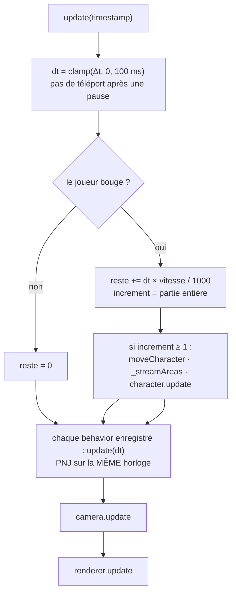
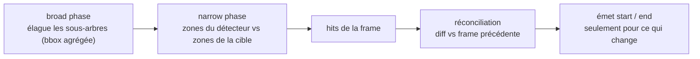
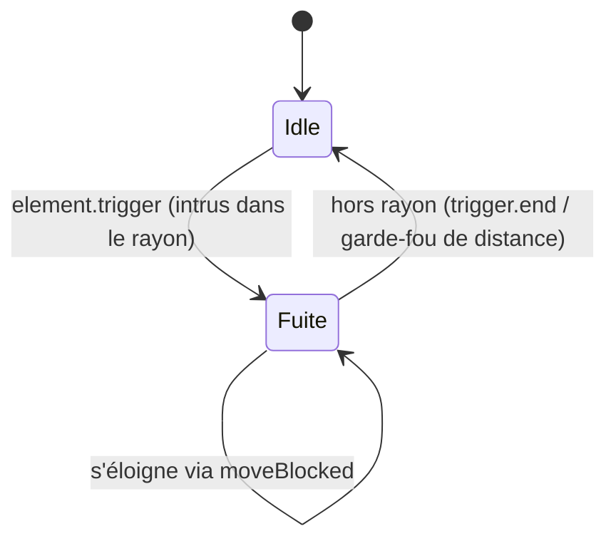

# Le moteur de mini-RPG

Un moteur **vanilla JS, sans framework**, qui rend une carte tuilée façon RPG
dans un conteneur DOM : board scrollable, éléments positionnés, personnages
animés, collisions, events. Il ne connaît **rien** de l'app qui l'embarque.

> Usage rapide, frontière et configuration des chemins d'assets :
> voir **[`src/engine/README.md`](../../src/engine/README.md)**. Ce document-ci
> décrit les **concepts internes**. Le détail au niveau code est dans les
> **JSDoc** (exhaustifs) de chaque fichier.

Le catalogue moteur (`/engine/catalog/`) propose désormais une navigation par
familles (index cliquable), des filtres combinables (texte/type/zones), un tri,
et un état partageable dans l'URL (`q`, `kind`, `zone`, `sort`).

## 1. Scene graph : `Element` et ses sous-systèmes

`Element` est le nœud de base de l'arbre de scène. Plutôt qu'une god-class, il
**compose** des sous-systèmes ; ses méthodes publiques sont de fines façades
au-dessus d'eux :

- **`Geometry`** — `x/y/width/height` **locaux** (relatifs au parent).
- **`SceneGraph`** — enfants, parent, `getChildByName`, et les **offsets absolus**
  (`offsetX/offsetY` = position dans le monde, en accumulant la chaîne de parents).
- **`CollisionSystem`** — zones de collision/trigger, bounding boxes, détection.
- **`EventEmitter`** — events locaux, qui **remontent** ensuite à l'`Application`.
- **`Renderer`** — le nœud DOM et sa mise à jour visuelle.

Coordonnées : **locales** (`x()`, `y()`) vs **monde** (`offsetX()`, `offsetY()`).
La collision et la profondeur raisonnent en coordonnées monde.

## 2. Board, Area et streaming

- **`Area`** — une tuile de carte (taille du viewport) contenant des éléments en
  coordonnées locales.
- **`Board`** — la grille d'`Area`s (un `Element` lui-même).

Pour ne pas charger une carte infinie, le `Viewport` **streame** les areas : il
ne garde qu'une fenêtre **7×7** autour du joueur. Le streaming est **paresseux et
event-driven** : il ne fait un travail que lorsque le joueur **change d'area**
(`_streamAreas` compare aux coords d'area précédentes) — marcher à l'intérieur
d'une area ne coûte rien. Chargement en 7×7, libération au-delà d'un anneau
(hystérésis, pour ne pas thrash sur une frontière).

Quand une area est libérée, elle est désormais **détruite** (`destroy`) : elle
est retirée du scene-graph du board, son rendu est détaché du DOM, puis la
matrice `board.areas` est nettoyée. Le board recalcule aussi ses bounding boxes
agrégées après retrait d'enfants : elles ne grossissent donc plus indéfiniment
au fil du streaming (coût collision et update bornés par la fenêtre active).

## 3. Viewport : la game loop

Le `Viewport` porte la **boucle de jeu** (une seule, sur `requestAnimationFrame`) :



Points clés :

- **Une seule horloge.** Joueur et PNJ sont tickés par la même game loop avec le
  même `dt` (les behaviors s'enregistrent via `viewport.addBehavior`). Pas de
  `setTimeout` maison.
- **Le sous-pixel est mis en banque, pas jeté.** Le déplacement se fait en pixels
  entiers (les sprites pixel-art ne doivent pas atterrir sur un demi-pixel), mais
  la fraction restante est **reportée sur la frame suivante**. Arrondir chaque
  frame isolément liait la vitesse de marche à la fréquence d'écran — et sous un
  pixel par frame (écran rapide ou personnage lent) chaque frame arrondissait à
  zéro : le personnage ne partait **jamais**. La banque se remet à zéro à l'arrêt,
  pour qu'un reste dormant ne ressorte pas en saut au pas suivant.
- **rAF est en pause quand l'onglet est caché** → tout gèle (voir
  [development.md](development.md) pour tester en pilotage manuel).

## 4. Camera

`Camera` est un objet de première classe qui **suit une cible** (`follow(target)`)
et se centre dessus en espace monde. Elle est **découplée** du personnage : le
joueur se déplace dans le monde, la caméra le suit — ce qui évite le couplage
« caméra bindée en dur au personnage » qui posait problème historiquement.

## 5. Rendu et profondeur (algorithme du peintre)

Chaque `Renderer.render()` synchronise taille / position / profondeur du nœud DOM
avec le modèle, en **n'écrivant que ce qui a changé** (caches `_lastLeft`, etc.).

La **profondeur** (z-index) suit l'algorithme du peintre en espace monde :

```
z = DEPTH_BASE + offsetY() + height()
```

- `offsetY + height` trie par le **bas** de l'élément (ce qui est plus « devant »
  passe au-dessus), de façon cohérente entre areas (la caméra n'affecte jamais z).
- `DEPTH_BASE` (grande constante positive) garde le z **au-dessus du sol** même au
  nord de l'origine, où `offsetY` devient négatif (sinon l'élément passe derrière
  l'herbe, qui est le background des areas à z ≈ 0).

## 6. Collisions

Le `CollisionSystem` fait du **broad + narrow phase** et sépare **détection** et
**réconciliation** :

- **Broad phase** — élague tout sous-arbre dont la bounding box agrégée ne
  recoupe pas (pruning). Cet agrégat borne **les zones de collision et de trigger**
  — les siennes et celles de ses enfants — et **jamais le rectangle de l'élément** :
  un élément sans zone ne contribue rien, et son agrégat reste *indéfini* (coins
  `null`), donc inoffensif. Cette sémantique vaut par les **deux** chemins qui
  construisent la boîte : la croissance incrémentale (ajout de zone / d'enfant) et
  le recalcul après détachement d'un enfant.
- **Narrow phase** — teste les **vraies zones de collision du détecteur** (son
  « corps ») contre les zones de la cible. ⚠️ *À ne pas confondre avec l'agrégat* :
  l'agrégat inclut aussi les zones trigger, donc l'utiliser en narrow phase ferait
  « collisionner » un perso à grand rayon trigger avec tout ce qui l'entoure
  (bug corrigé — la narrow phase utilise les zones, l'agrégat reste pour le broad).
- **Détection** (`_detect`/`_hitZones`) — pure : renvoie les hits, sans events.
- **Réconciliation** (`_reconcile`) — diffe les hits vs la frame précédente et
  n'émet que les events qui changent : `element.collision` / `.collision.end`
  (et pareil pour `trigger`). Pas de « clear » de tout l'arbre à chaque frame.



Deux types de zones :

- **collision** — solides : bloquent le déplacement.
- **trigger** — capteurs : émettent `element.trigger` / `.trigger.end` sans bloquer.

### Passe unique collision + trigger

Le joueur détecte les deux en **une seule traversée** :
`detectCollisionAndTrigger(board)` réconcilie la collision et renvoie les triggers
bruts, que le `Viewport` réconcilie **à la position finale** (après un éventuel
revert de collision) — pour qu'un trigger collé à un mur ne se déclenche pas quand
on tape ce mur. `overlaps(element)` est une variante **pure** (booléen, sans
events), pour une IA qui sonde son déplacement.

### La primitive de déplacement

`Character.moveBlocked(dx, dy, isBlocked)` bouge puis **annule** si le prédicat
`isBlocked()` signale une collision. Le joueur et les behaviors NPC la partagent,
chacun avec sa propre politique de collision.

## 7. Personnages et behaviors

`Character` (un `Element` animé) ne porte **pas** d'IA : elle est déléguée à un
**behavior** interchangeable, tické par la game loop (`update(dt)` qui accumule
le temps et rejoue un pas à la cadence voulue) :

- **`PatrolBehavior`** — allers-retours sur un axe, inverse à distance atteinte
  **ou** sur collision.
- **`FleeBehavior`** — crée une **zone trigger** (rayon de détection) ; quand
  quelque chose y entre (event `element.trigger`), le PNJ fuit à l'opposé.
- **`CharacterBehavior`** — errance aléatoire.

Exemple, le cycle de `FleeBehavior` (entièrement piloté par le trigger) :



L'animation est isolée dans **`CharacterAnimator`** (horloge de cycle de marche),
et la **bulle de dialogue** passe par le renderer :
`character.quickReaction(html)`, `clearQuickReaction()`, `isReacting()`, plus les
events `element.reaction.show` / `element.reaction.hide`.

## 8. Éléments déclaratifs

Les éléments intégrés (maisons, arbres, clôtures, fleurs, PNJ) sont des
**`SpriteElement`** décrits par un `static descriptor` (atlas, frame, zones de
collision/trigger, `manualZ`) — pas de code de rendu à écrire. Les PNJ
(`CharacterBases/`) sont des `Character` avec un offset de sprite-sheet. Le
moteur expose aujourd'hui les 8 bases présentes sur `images/characters/characters-00.png`.

### Planche `flowers-00` (219 éléments)

`images/map/flowers-00.png` est une grille régulière de **16×16 cellules de
32 px**. Ses 219 sprites (fleurs, champignons, feuillages, nénuphars, champs,
puits, souche, troncs, dalles, rochers) vivent sous
`map/Elements/Flowers/`, découpés par thème (`Blossoms`, `Clusters`, `Fields`,
`Foliage`, `Mushrooms`, `Props`, `Water`) et ré-exportés en bloc par
`Flowers/index.js` puis par le baril du moteur.

Comme la planche est régulière, chaque élément tient en **une ligne** : le helper
`cell(col, row, extra?)` de `Flowers/atlas.js` dérive tout le descripteur de la
position de la cellule.

```js
export class LilyPad00 extends SpriteElement { static descriptor = cell(8, 0); }
export class Well00 extends SpriteElement { static descriptor = cell(2, 8, { collision: [3, 14, 26, 16] }); }
export class FlowerField00 extends SpriteElement { static descriptor = cell(14, 9, SPAN_2X2); }
```

Conventions de la planche :

- **Nommage** `<Famille><NN>`, l'index suivant l'ordre de lecture de l'atlas
  (29 familles : `Blossom`, `Mushroom`, `LilyPad`, `FlowerField`…). Les teintes ne
  sont pas dans les noms — le [catalogue](http://localhost:5173/engine/catalog/)
  les montre.
- **Ombres** : l'art porte sa propre ombre peinte → `shadow: false` partout, sauf
  `Flower00` (antérieur à cette passe, descripteur figé).
- **Zones** : rien par défaut ; `collision` uniquement sur ce qui bloque
  (`Well00`, `Stump00/01`, `HollowLog00..02`, `Rock00..03`), `manualZ` sur les
  sols (`FlowerGrass*`, `FlowerPatch*`, `StoneSlab00`).
- `test/flowers-00.test.js` verrouille la découpe (alignement 32 px, bornes
  512×512, aucune cellule découpée deux fois) et ces conventions.

### Planche `map-sprites-01` (lot arbres autonomes)

`images/map/map-sprites-01.png` mélange objets posables et fragments
d'assemblage (autotiles, coins, bandes de façade, morceaux de routes/arches).
Le moteur n'ayant pas de tuilage automatique, le lot public retient seulement
les sprites autonomes, nommables et posables tels quels.

Premier lot exposé sous `map/Elements/MapSprites01/` :

- `Conifer00..35`
- `LeafTree00..26`
- `CanopyTree00..23`
- `TallTree00..29`
- `DeadTree00..24`
- `SaplingTree00..05`

Soit **148 éléments** issus de la planche, tous exportés via `index.js`.

Conventions de ce lot :

- helper `sprite(x, y, width, height, extra?)` (pixels, pas de grille régulière)
- ombre moteur coupée (`shadow: false`) : l'art porte déjà sa propre ombre
- `collision` sur tous ces sprites (objets bloquants), via empreintes de tronc
  (`treeCollision` / `deadTreeCollision`)
- les 6 éléments historiques (`Tree00`, `Ground00`, `Fountain00`, `Sunflower00`,
  `Fence00H`, `Fence00V`) restent inchangés

Le reste de la planche (matériaux d'assemblage + objets ambigus) est documenté
et volontairement exclu de ce lot pour préserver la lisibilité du catalogue et
l'API publique.

### Planche `map-sprites-02` (premier lot de végétation)

`images/map/map-sprites-02.png` est une atlas beaucoup plus riche, mêlant objets
autonomes et fragments d'assemblage. Ce ticket expose seulement un premier lot
de végétation autonome du coin supérieur gauche : `Tree01..Tree30`.

Conventions de ce lot :

- helper pixel `sprite(x, y, width, height, extra?)` (pas de grille fiable)
- arbres / jeunes arbres / souches posables, tous `shadow: false`
- `collision` sur ces sprites bloquants, calculée au plus simple sur le tronc
- le reste de la planche reste hors périmètre de ce ticket et sera loti
  séparément

## 9. Events

Tout remonte à l'`Application` via `handle()`. Principaux events (préfixe
`element.`) : `element.click`, `element.collision(.end)`, `element.trigger(.end)`,
`element.reaction.show/hide`, et `map.update` (émis par le Viewport à chaque
déplacement du joueur).

## 10. Debug

`applyDebugFlag()` ajoute la classe `body.debug` si l'URL porte `?debug=1` ;
`viewport.renderDebug()` (auto-gated sur `body.debug`) dessine alors les bounding
boxes et les zones (collision en jaune, trigger en cyan). Les zones **s'allument
en magenta au contact** : `BoundingBox.collided()` toggle la classe `collided` sur
sa boîte de debug (coût nul hors debug — la boîte n'existe pas).

## 11. API publique

Tout passe par **`src/engine/index.js`** : `Application`, `Viewport`, `Camera`,
`Board`, `Area`, `Element`, `SpriteElement`, `Character` ; les sous-systèmes
(`CollisionSystem`, `SceneGraph`, `CharacterAnimator`, `CharacterBehavior`,
`PatrolBehavior`, `FleeBehavior`) ; les renderers ; les éléments intégrés et
bases de personnages ; et la config (`setAssetsBase`, `applyDebugFlag`).
