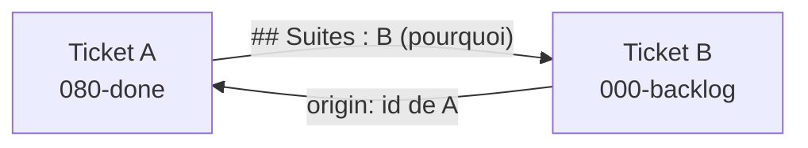

## Objectif

Un ticket en engendre souvent d'autres : une piste repérée pendant le travail, un
défaut découvert en review, une correction qui appelle sa suite. Aujourd'hui ce
lien n'existe **nulle part** — `ticket-work` dit seulement « une sous-tâche qui
émerge → la déposer en `000-backlog` », sans dire comment la **rattacher**. Le
board perd donc la généalogie : on lit un ticket sans savoir ce qu'il a produit,
et on lit un ticket de suite sans savoir d'où il vient.

Cas réels déjà présents sur le board :

- `2026-07-26_14-19` (checksum mort) a engendré `2026-07-26_18-00` (le champ
  `Status` rendait le checksum instable) — lien écrit à la main, dans le corps du
  texte, sans convention ;
- `2026-07-26_00-48` (audit des grilles de sprites) prévoit explicitement de
  « créer les tickets de réalisation » à l'issue de l'audit ;
- `2026-07-26_18-00` a identifié une suite (fixtures du mock au `Status` figé)
  qui n'a été **ni créée ni tracée**, faute de mécanisme.

On veut une **étape explicite de fin de ticket** — « ce ticket a-t-il des
suites ? » — et un **lien bidirectionnel** entre le ticket d'origine et ses
suites.

## Spécifications

### Fonctionnel

- **À la clôture** d'un ticket (étape *validate*), l'agent se pose la question des
  suites. Si oui : créer les tickets dans `000-backlog` (via
  [ticket-create](../../agents/recipes/workflow/ticket-create.md)) et les lister dans la
  rubrique **Suites** du ticket courant.
- Une suite peut aussi naître **en cours de route** (*work*, *verify*) : la recipe
  couvre ce cas, et `ticket-work` y renvoie au lieu de dupliquer la consigne.
- Un ticket créé comme suite porte la référence de son **ticket d'origine**.
- Le cas « aucune suite » est **explicite** (`aucune`) : distinguer « rien à
  faire » de « personne n'y a réfléchi ».
- Garde-fou : une suite se **dépose**, elle ne se traite pas dans la foulée du
  ticket courant — la recipe rappelle la règle « ne pas dériver ».

### Technique

- Nouvelle recipe `meta/agents/recipes/workflow/ticket-follow-up.md` : courte,
  orientée étapes, **agnostique au projet** (règles d'écriture des recipes).
- `meta/workflow/TEMPLATE.md` :
  - frontmatter → champ `origin:` (id du ticket d'origine, vide par défaut) ;
  - corps → rubrique `## Suites` (les tickets engendrés, une ligne chacun avec le
    *pourquoi*).
- **Référencer par `id`, jamais par chemin** : un ticket change de colonne à
  chaque étape, donc tout lien relatif `meta/workflow/000-backlog/…` pourrit dès
  la transition suivante. L'`id` (`2026-07-26_14-19`) est stable et se `grep`.
- **Bookkeeping** : les tickets de suite se créent **sur `main`, depuis le tree
  principal** — jamais depuis la branche du ticket en cours, sinon le fichier
  n'arrive sur le board qu'au merge (et diverge en cas de rebase).
- Mises à jour de cohérence (la doc obsolète est un bug) :
  - [work-a-task](../../agents/recipes/workflow/work-a-task.md) — tableau des étapes et/ou
    règles transverses ;
  - [ticket-validate](../../agents/recipes/workflow/ticket-validate.md) — l'étape qui
    déclenche la question ; [ticket-work](../../agents/recipes/workflow/ticket-work.md) —
    renvoi pour le cas « sous-tâche qui émerge » ;
  - index : `meta/agents/recipes/README.md`, `meta/README.md` ;
  - vérifier les trois points d'entrée (`CLAUDE.md`, `AGENTS.md`,
    `.github/copilot-instructions.md`) : les mettre à jour **seulement** si la
    règle agent change, pas pour l'ajout d'une recipe.
- Passer la recipe
  [audit-workflow-consistency](../../agents/recipes/audit-workflow-consistency.md)
  en fin de travail : c'est exactement son cas d'usage (évolution du workflow).

### Schéma

### Risques / questions ouvertes

- **Nommage** à trancher en *specify* : `## Suites` (français, cohérent avec le
  reste du board) vs `## Follow-up`. Recommandation : `## Suites`, en mentionnant
  « follow-up » dans la ligne d'explication pour que le terme reste cherchable.
- **Frontmatter + rubrique, ou rubrique seule ?** Recommandation : `origin:` en
  frontmatter côté suite (un seul parent, machine-lisible) et rubrique côté
  origine (n suites, avec le motif). L'asymétrie est voulue.
- **Ne pas réécrire le board en masse** : les tickets déjà en `080-done` ne sont
  pas rétro-remplis, à l'exception du couple démonstratif ci-dessous.
- Risque de cérémonie : la rubrique doit rester **une ligne** dans le cas courant.

## Contexte / liens

- `meta/workflow/TEMPLATE.md` (structure d'un ticket)
- `meta/agents/recipes/workflow/` (les 5 recipes d'étape + l'overview)
- `meta/agents/recipes/README.md`, `meta/README.md` (index à tenir à jour)
- `meta/agents/workflow.md` (règle « tenir la documentation à jour »)
- Couple démonstratif réel : `2026-07-26_14-19` → `2026-07-26_18-00`

## Definition of Done

- [ ] `meta/agents/recipes/workflow/ticket-follow-up.md` créé : court, orienté
      étapes, agnostique au projet, cohérent avec les recipes d'étape existantes.
- [ ] `TEMPLATE.md` porte le champ `origin:` et la rubrique des suites, avec une
      ligne d'explication (dont le cas « aucune »).
- [ ] Les liens se font par **id**, jamais par chemin de colonne — la recipe le dit
      explicitement.
- [ ] La règle « créer les suites sur `main`, depuis le tree principal » est écrite.
- [ ] `work-a-task`, `ticket-validate` et `ticket-work` renvoient vers la recipe ;
      les index (`meta/agents/recipes/README.md`, `meta/README.md`) sont à jour.
- [ ] Les trois points d'entrée sont vérifiés (mis à jour seulement si nécessaire).
- [ ] Couple démonstratif renseigné : `2026-07-26_18-00` porte `origin: 2026-07-26_14-19`,
      et `2026-07-26_14-19` liste sa suite.
- [ ] Passe `audit-workflow-consistency` faite ; `npm run verify` vert.

## Journal

Entrées datées `- [YYYY-MM-DD HH:MM] …` (heure **réelle**, ex. `date '+%Y-%m-%d
%H:%M'`), par étape ; timeline **monotone** — rien ne postdate `done`.

### Travail

-

### Vérification

-

### Validation

-
