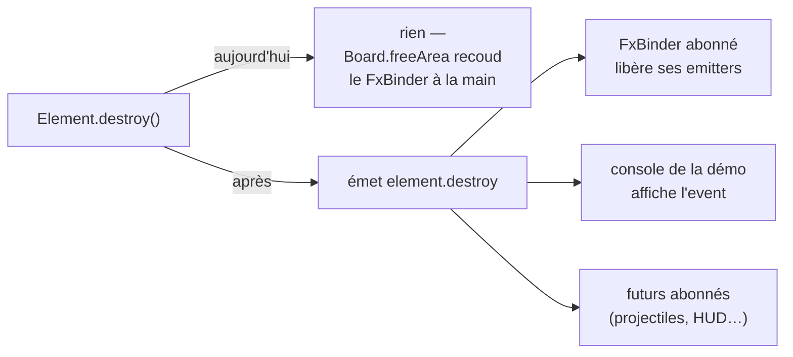

## Objectif

Le moteur doit devenir un **moteur de jeu** (projectiles, explosions, dégâts) et
non plus seulement un moteur de déambulation. Le socle sur lequel tout ça
reposera — les events — est aujourd'hui **embryonnaire**, et trois défauts
mesurés le rendent inapte à des entités qui naissent et meurent en continu.

Ce ticket est le **premier** d'une série de blindage (events → entités
dynamiques → horloge fixe → collision par paires → projectiles). Il a une valeur
propre, sans le moindre projectile : il **supprime** un couplage existant.

## Spécifications

### L'état des lieux (mesuré le 2026-08-02)

| Constat | Où | Conséquence |
|---|---|---|
| `EventEmitter` n'a **pas de `off()`** | `src/engine/map/EventEmitter.js` | un abonné éphémère ne peut pas se désabonner d'un émetteur durable → **fuite mémoire** |
| `on()` retourne un **index inutilisé** | idem | l'index deviendrait faux dès le premier retrait ; aucun appelant ne le lit |
| `emit()` itère la **liste vivante** (`.map`) | idem | un callback qui se désabonne lui-même **fait sauter le suivant** |
| `handle()` saute à l'application | `Element.js:222` | pas de niveau intermédiaire : on écoute l'élément exact, ou tout |
| `handle()` suppose l'élément **attaché** | `Element.js:224`, `_application = Application.mainInstance` | émettre depuis un élément détaché **jette** |
| Noms **concaténés**, déjà incohérents | `CollisionSystem.js:377` vs `:391` | `_eventPrefix + type` d'un côté, `'element.'` **en dur** de l'autre : une sous-classe qui changerait son préfixe verrait ses `.end` divorcer de ses débuts |
| **Neuf** noms d'events en tout, **aucun** de cycle de vie | tout le moteur | d'où la couture manuelle de `Board.freeArea` |

Le commentaire de `Board.js:136` est l'aveu écrit du dernier point :
« `destroy()` détache et **ne prévient personne** ».

### Ce que « typé » veut dire ici (vanilla JS, pas de TypeScript)

Trois choses, et **pas** de validation à l'exécution (coût par émission, n'attrape
rien qu'un test n'attrape mieux) :

1. **Un catalogue de noms déclaré** — des constantes exportées, gelées, aux
   **valeurs identiques aux chaînes actuelles** (rien ne casse). Ça tue les
   typos, ça rend les events **découvrables**, et ça donne à la console ses
   catégories gratuitement.
2. **Une enveloppe de payload commune** — un tronc `{ type, source, at }` plus les
   données propres à l'event. C'est ce tronc qui rend une console *générique*
   possible, sans un `if` par type.
3. **Un `@typedef` JSDoc par event** — le seul « typage » qui rende de
   l'autocomplétion en vanilla, et déjà la convention du dépôt.

### Décisions prises (à ne pas rouvrir en cours de route)

- **`on()` retourne une fonction de désabonnement**, pas un index. Un index est
  invalidé par le premier retrait ; la fermeture, jamais. Le retour actuel n'est
  lu nulle part → le changement est gratuit.
- **`emit()` itère une copie** de la liste des callbacks.
- **Pas de vrai bubbling** parent → parent : on **assume** le modèle *local +
  bus global*, plus simple et plus rapide. C'est un choix, il s'écrit dans la
  doc ; le jour où un niveau intermédiaire manque, ce sera un autre ticket.
- **`onAny(callback)`** existe — la console ne peut pas s'abonner nom par nom, et
  c'est précisément l'abonné qui a besoin de tout voir.
- **Le bus global reste hébergé par `Application`** : pas de nouveau singleton.

### Le cycle de vie — le vrai gain

`Element.destroy()` émet. Dès lors, **`FxBinder` s'abonne au lieu d'être appelé**,
et la ligne cousue à la main dans `Board.freeArea()` **disparaît**. C'est le
critère qui rend ce ticket vérifiable au-delà du déclaratif : il retire du
couplage.

### Ce qui **ne** passe **pas** par le bus

La règle, à écrire dans la doc : **le bus porte les faits de jeu** (une entité est
née, a été touchée, est morte), **pas les pas de simulation** (le mouvement par
pixel, la détection par frame). Un payload alloué par frame et par entité coûte
cher et rend le flux illisible.

`map.update` est déjà du mauvais côté de cette ligne — il est émis à **chaque
frame où le joueur se déplace** (`Viewport.js:552`). Il est **conservé tel quel**
ici (`ContainerKingdomLayout.js:247` en dépend) ; son sort est un candidat de
suite, pas ce ticket.

### La console d'events (démo)

Pas un confort : un **instrument de mesure de l'architecture**. Si un fait de jeu
n'est pas lisible dedans, c'est qu'il n'est pas modélisé.

- **Coalescence des répétitions** (`element.collision ×247`) — *critique* : sans
  elle, un event de déplacement noie tout en une seconde.
- **Filtre par préfixe**, alimenté par le catalogue, + un compteur d'events/s.
- **Plafond d'entrées** (tampon circulaire) — une console sans plafond fuit
  exactement comme le reste.
- **Clic sur une entrée → surligne l'élément source** dans la scène. C'est ce qui
  la rend utile plutôt que décorative.
- **Derrière `?debug=1`** (flag existant, `src/engine/debug.js`) : `onAny` sur un
  bus chaud ne doit pas être branché en permanence.
- Outil du **moteur** (`src/engine/tools/`), exporté depuis `index.js`, **ignorant
  de Container Kingdom**.

Le `GameConsole` actuel est trop naïf pour ce rôle (ni plafond, ni filtre, et un
`innerHTML` par entrée — donc une injection dès qu'un event porte du texte
d'origine externe). **À trancher au début du travail** : le durcir, ou en faire un
outil frère. Dans les deux cas, **pas d'`innerHTML`** pour du contenu d'event.

## Firewalls / risques

1. **Le retrait pendant l'émission** est le bug classique de ce genre de bus :
   un callback qui se désabonne lui-même décale la liste et fait sauter le
   suivant. Le code actuel y est exposé. Ça se prouve par un test, pas par une
   relecture.
2. **`onAny` est un chemin chaud.** Il ne doit rien allouer quand personne n'est
   abonné, et la console ne doit exister que sous `?debug=1`.
3. **Le catalogue ne doit pas devenir un fourre-tout** : il liste ce que le
   **moteur** émet. Un event applicatif (Container Kingdom) n'y entre pas — c'est
   la frontière moteur qui parle.
4. **Ne pas renommer les events existants.** Les neuf noms actuels gardent leurs
   valeurs ; le catalogue les *déclare*, il ne les remplace pas.
5. **Un émetteur détaché ne doit jamais jeter** — c'est exactement le cas d'un
   projectile créé avant attachement, ou survivant à son area.
6. **Ne pas glisser vers la couche d'entités dynamiques** : elle est le ticket
   suivant. Ici, on pose le socle et on le prouve sur l'existant.

## Contexte / liens

- Vérifié : **rien d'équivalent au board le 2026-08-02**, `080-done` compris.
- Le bus : `src/engine/map/EventEmitter.js`, `src/engine/map/Application.js`,
  `src/engine/map/Element.js` (`handle`, `addEventListener`).
- Les émetteurs actuels : `src/engine/map/CollisionSystem.js`,
  `src/engine/map/Character.js`, `src/engine/map/Area.js`,
  `src/engine/map/Viewport.js`.
- La couture à supprimer : `src/engine/map/Board.js` (`freeArea`) et
  `src/engine/fx/FxBinder.js`.
- La console existante : `src/engine/tools/GameConsole.js` ; la démo :
  `src/engine/demo/demo.js`.
- Le flag debug : `src/engine/debug.js`.
- Doc à tenir : `meta/documentation/engine.md`, `meta/documentation/architecture.md`.
- Tickets voisins (la suite de la série) : `engine_120_loop-stop-and-teardown`,
  `engine_130_frame-rate-independent-animation`.

## Definition of Done

- [ ] `off()` / désabonnement : `on()` **retourne une fonction** qui retire le
      callback, et un test prouve qu'un abonné retiré n'est plus appelé.
- [ ] Un test prouve qu'un **callback qui se désabonne pendant l'émission** ne
      fait pas sauter le suivant.
- [ ] Un **catalogue de noms** est exporté depuis `src/engine/index.js`, avec les
      **valeurs actuelles inchangées**.
- [ ] **Plus aucun nom d'event assemblé par concaténation** dans le moteur —
      l'incohérence `CollisionSystem.js:377` / `:391` a disparu.
- [ ] Les events portent une **enveloppe commune** documentée, et chacun a son
      `@typedef` JSDoc.
- [ ] `Element.destroy()` **émet** un event de cycle de vie.
- [ ] **La couture disparaît** : `FxBinder` s'abonne, et l'appel manuel à
      `unbind` dans `Board.freeArea()` est supprimé — sans régression des
      emitters (démo à l'appui).
- [ ] Émettre depuis un élément **sans application ne jette pas** (test).
- [ ] `onAny()` existe et **ne coûte rien** quand personne n'est abonné.
- [ ] **La console est dans la démo**, sous `?debug=1` : coalescence, filtre,
      plafond d'entrées, clic → surlignage de la source. **Capture au journal —
      c'est le critère qui fait foi.**
- [ ] Aucun `innerHTML` pour du contenu d'event.
- [ ] Aucun event émis **par frame et par entité** sur le chemin chaud.
- [ ] `meta/documentation/engine.md` à jour (le bus, le catalogue, la règle
      « faits de jeu, pas pas de simulation », le choix assumé local + global) ;
      `npm run verify` vert.

## Suite

_Rempli à la clôture._

-

## Journal

Entrées datées `- [YYYY-MM-DD HH:MM] …` (heure **réelle**), par étape ; timeline
**monotone**.

### Travail

-

### Vérification

-

### Validation

-
