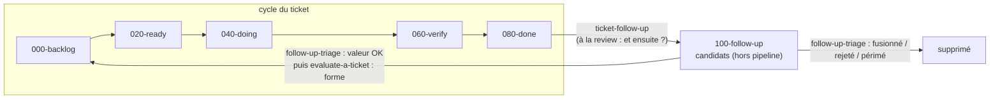

## Objectif

Un ticket qui se termine emporte avec lui tout ce que son auteur a compris en
chemin : ce qui reste à faire, ce qu'on a volontairement laissé de côté, la piste
entrevue, la dette assumée, la limite de la vérification. **Rien dans le ticket
ne regarde vers l'avant** — l'`Objectif` dit l'intention de départ, la `DoD` est
le contrat, le `Journal` raconte le passé. Résultat : le prochain qui ouvre le
sujet repart à zéro.

On veut qu'**à la clôture, chaque ticket réponde à « et ensuite ? »** — dans une
rubrique dédiée, courte, y compris quand la réponse est « rien ».

Créer un ticket de suite est **une** des issues possibles, pas le but : une piste
qui ne mérite pas encore de ticket a quand même sa place dans cette rubrique. Le
rattachement entre tickets (savoir qui a engendré quoi) est un **effet de bord
utile**, pas l'objet.

Preuve que le besoin est réel : le ticket `2026-07-26_18-00` s'est terminé sur
« suite identifiée, non traitée ici : les fixtures du mock ont un `Status` figé,
ce qui a rendu ce bug invisible en dev » — écrit **dans le journal de
validation**, faute d'endroit prévu. Le ticket `2026-07-26_00-48` (audit des
grilles) prévoit lui aussi d'ouvrir des tickets à son issue, sans convention pour
les tracer.

## Spécifications

### Fonctionnel — la rubrique `Suite`

- Toute clôture de ticket (étape *validate*, au moment de la review) renseigne la
  rubrique **Suite** :
  - ce que le ticket **ouvre** (piste, amélioration entrevue, question restée
    sans réponse) ;
  - ce qu'il **laisse volontairement de côté** (périmètre écarté, limite de la
    vérification, dette acceptée) ;
  - les **candidats déposés** en `100-follow-up`, s'il y en a.
- Rubrique **obligatoire mais courte** : une ligne suffit dans le cas courant, et
  `aucune` est une réponse valable — elle dit « on y a réfléchi », pas « on a
  oublié ».

### Fonctionnel — la colonne `100-follow-up`

Nouvelle colonne `meta/workflow/100-follow-up/`, **hors pipeline** : c'est une
**boîte de sortie de candidats**, pas une étape du cycle.

- Un **ticket** ne s'y déplace jamais. Elle ne reçoit que des **candidats** :
  notes courtes (quelques lignes, pas le `TEMPLATE`), bon marché à écrire comme à
  jeter.
- Le numéro `100` est **volontairement détaché** de la plage `000` → `080` : il ne
  suit pas `080-done` dans le cycle, il **réalimente `000-backlog`** après tri.
- Elle protège la propriété la plus fragile du backlog : être **priorisé**. Un
  backlog où chacun déverse ses pistes n'est plus qu'une liste.
- Un candidat a **trois issues, toutes explicites** : promu en ticket (`git mv`
  vers `000-backlog` après passage au `TEMPLATE`), **fusionné** dans un ticket
  existant, ou **rejeté** (fichier supprimé, motif noté en une ligne dans le
  commit de tri).

### Fonctionnel — le tri des candidats (recipe consommatrice)

La colonne a besoin de sa recipe **consommatrice** : sans elle on livre un
producteur sans consommateur, c'est-à-dire la décharge. Les deux recipes sont donc
**dans le même changement**.

- Nouvelle recipe `meta/agents/recipes/workflow/follow-up-triage.md` : parcourir
  `100-follow-up` et statuer sur **chaque** candidat (promu / fusionné / rejeté).
- **Tri froid, groupé, différé** : il se fait en **une passe sur tout le dossier**,
  plus tard que la clôture qui l'a produit, en comparant les candidats **entre eux
  et au backlog existant**. Celui qui clôt un ticket est enthousiaste sur ses
  propres pistes ; candidat par candidat, au fil de l'eau, on promeut tout — c'est
  la comparaison qui rend le rejet possible.
- **Deux portes, dans cet ordre** :
  1. **Valeur** — « faut-il le faire ? » : c'est cette recipe qui la pose ;
  2. **Forme** — « est-ce actionnable ? » :
     [evaluate-a-ticket](../../agents/recipes/evaluate-a-ticket.md), appliqué **seulement**
     aux candidats promus, une fois passés au `TEMPLATE`. Inutile de rendre
     actionnable ce qu'on va jeter — et sa propriété « une seule passe » est
     préservée.
- **Critères de valeur** (falsifiables, pour que le tri reste mécanique) :
  - **Preuve** — le candidat s'appuie sur un constat vérifié (bug reproduit,
    mesure, gêne rencontrée), pas sur un « ce serait mieux si » ;
  - **Coût du non-fait** — qu'est-ce qui casse ou coûte si on ne le fait jamais ?
    « Rien de perceptible » ⇒ rejet ;
  - **Doublon** — déjà couvert par un ticket du backlog ou par la rubrique `Suite`
    d'un autre ticket ⇒ fusion ;
  - **Péremption** — **un sursis, pas deux** : un candidat conservé à un tri est
    marqué (`- [date] tri : conservé`) ; s'il est encore là au tri suivant, il est
    **rejeté**. Ne pas l'avoir choisi deux fois *est* la réponse. Règle mécanique
    anti-décharge, sans compteur à maintenir ;
  - **Reste de DoD** — si le candidat relevait en fait du ticket d'origine, ce
    n'est pas un candidat mais le signe d'un ticket **clos trop tôt** : le
    signaler comme tel plutôt que le promouvoir.
- **Quand** : au **démarrage d'une tâche** (première étape de
  [work-a-task](../../agents/recipes/workflow/work-a-task.md)) — si `100-follow-up` n'est
  pas vide, on le trie **avant** de prendre la tâche suivante. C'est le seul
  moment qui revient forcément, donc le plus mécanique ; et il garde le dossier
  quasi vide, donc le tri coûte une minute.

### Fonctionnel — ce qui empêche la boucle infinie

Le dossier seul ne borne rien : sans barre de valeur, il produit une chaîne de
tickets qui s'engendrent. Règles à écrire noir sur blanc dans la recipe :

- **Le résultat par défaut de l'étape follow-up est du texte, pas un ticket.** La
  rubrique `Suite` suffit dans la majorité des cas ; le candidat est l'exception.
- **Deux portes** avant qu'un candidat devienne un ticket : la **valeur**
  (`follow-up-triage`, ci-dessus) puis la **forme**
  ([evaluate-a-ticket](../../agents/recipes/evaluate-a-ticket.md), qui impose déjà
  « une seule passe, pas de boucle »).
- **Interdit — le follow-up « méta »** : « vérifier que le suivi précédent a bien
  été fait », « auditer l'audit ». S'il faut du suivi pour du suivi, c'est que la
  tâche n'était pas finie.
- **Interdit — sortir du travail non terminé** du ticket courant sous forme de
  follow-up. C'est le vrai danger : « je crée un follow-up » devient la façon de
  clore un ticket à moitié fait. Ce qui relève de la DoD reste dans le ticket.
- **Tri forcé** : on ne prend pas une nouvelle tâche en laissant `100-follow-up`
  s'accumuler. Une boîte que personne ne vide devient une décharge — pire qu'un
  backlog dilué, parce qu'on apprend à ne plus l'ouvrir. Le seuil exact
  (à chaque prise de tâche ? au-delà de N candidats ?) est à trancher en
  *specify* ; il doit être **mécanique**, pas une bonne intention.

### Technique

- Deux recipes, courtes, orientées étapes, **agnostiques au projet**, dans la
  lignée des recipes d'étape existantes :
  - `meta/agents/recipes/workflow/ticket-follow-up.md` — la **production** (à la
    clôture : « et ensuite ? ») ;
  - `meta/agents/recipes/workflow/follow-up-triage.md` — la **consommation** (tri
    du dossier, promotion vers `000-backlog`). Elle **délègue** le jugement de
    forme à `evaluate-a-ticket` plutôt que de redire ses critères.
- `meta/workflow/100-follow-up/` avec un `.gitkeep` (comme les autres colonnes) ;
  nommage des candidats aligné sur celui des tickets
  (`YYYY-MM-DD_HH-MM_titre.md`), pour qu'une promotion soit un simple `git mv`.
- **Format d'un candidat** : pas de frontmatter — c'est ce qui le distingue d'un
  ticket. Un titre et trois lignes : **origine** (`id`), **constat** (la preuve),
  **coût du non-fait** ; plus les lignes datées ajoutées par les tris successifs.
- `meta/workflow/TEMPLATE.md` : rubrique `## Suite` (nom à confirmer) **après la
  DoD**, avec sa ligne d'explication, le cas `aucune`, et la distinction d'avec le
  `Journal` (le journal raconte le passé, la rubrique regarde l'avant).
- **Rattachement, version légère** : quand un ticket naît d'un autre, le mentionner
  par son **`id`** — dans la rubrique `Suite` côté origine, dans
  `Contexte / liens` côté suite. Pas de champ de frontmatter, pas de graphe à
  maintenir. Référencer par `id` (`2026-07-26_14-19`) et **jamais** par chemin de
  colonne, qui change à chaque transition.
- **Bookkeeping** : candidats et tickets de suite se créent **sur `main`, depuis
  le tree principal**, jamais depuis la branche du ticket en cours — sinon ils
  n'arrivent sur le board qu'au merge.
- Cohérence documentaire (la doc obsolète est un bug) :
  - `meta/README.md` — tableau des colonnes (+ dire que `100` est hors pipeline)
    et cycle de vie ;
  - [work-a-task](../../agents/recipes/workflow/work-a-task.md) — la question de la suite
    fait partie de la clôture ;
  - [ticket-validate](../../agents/recipes/workflow/ticket-validate.md) — étape qui la
    déclenche ; [ticket-work](../../agents/recipes/workflow/ticket-work.md) — renvoi pour
    la piste qui émerge en cours de route ;
  - index `meta/agents/recipes/README.md` ;
  - les trois points d'entrée (`CLAUDE.md`, `AGENTS.md`,
    `.github/copilot-instructions.md`) ne bougent **que si** la règle agent change.
- Terminer par la recipe
  [audit-workflow-consistency](../../agents/recipes/audit-workflow-consistency.md) :
  c'est son cas d'usage exact (évolution du workflow).

### Schéma

### Risques / questions ouvertes

- **Nommage — tranché** : `## Suite` (singulier : c'est la question « et
  ensuite ? »). Le mot « follow-up » reste dans la ligne d'explication pour qu'il
  demeure cherchable.
- **Risque de décharge** : `100-follow-up` ne vaut que par son tri. Le déclencheur
  retenu (au démarrage de chaque tâche) et la péremption au deuxième tri sont les
  deux règles qui le rendent mécanique — si elles sautent, la colonne devient une
  décharge et il vaut mieux la supprimer que la laisser pourrir.
- **Risque de cérémonie** : si la rubrique devient un formulaire à trous, elle
  sera remplie mécaniquement et ne vaudra rien. Écrire la recipe avec des exemples
  **réels** plutôt qu'un gabarit.
- **Ne pas rétro-remplir** tout `080-done` : se limiter au cas démonstratif.

## Contexte / liens

- `meta/workflow/TEMPLATE.md`, `meta/README.md` (colonnes et cycle de vie)
- `meta/agents/recipes/workflow/` (les 5 recipes d'étape + l'overview)
- `meta/agents/recipes/evaluate-a-ticket.md` (barre de valeur, anti-boucle)
- Cas réels : `2026-07-26_18-00` (suite enterrée dans le journal),
  `2026-07-26_00-48` (audit qui doit engendrer des tickets)

## Definition of Done

- [ ] `meta/agents/recipes/workflow/ticket-follow-up.md` créé : court, orienté
      étapes, agnostique au projet, avec des exemples réels plutôt qu'un gabarit.
- [ ] `meta/agents/recipes/workflow/follow-up-triage.md` créé : tri **groupé** du
      dossier, trois issues, critères de **valeur** falsifiables, délégation de la
      **forme** à `evaluate-a-ticket` (et pas de duplication de ses critères).
- [ ] `TEMPLATE.md` porte la rubrique de suite : ligne d'explication, cas
      `aucune`, distinction explicite d'avec le `Journal`.
- [ ] `meta/workflow/100-follow-up/` créé (`.gitkeep`), documenté comme **hors
      pipeline** dans `meta/README.md` : reçoit des **candidats**, jamais des
      tickets ; réalimente `000-backlog`.
- [ ] Les trois issues d'un candidat (promu / fusionné / rejeté) sont décrites.
- [ ] Les garde-fous anti-boucle sont écrits : texte par défaut, barre de valeur
      via `evaluate-a-ticket`, interdiction du follow-up « méta », interdiction de
      sortir du travail non terminé, règle de tri **mécanique**.
- [ ] Les règles « référencer par `id` » et « créer sur `main`, depuis le tree
      principal » sont écrites.
- [ ] `work-a-task`, `ticket-validate`, `ticket-work` et les index
      (`meta/agents/recipes/README.md`, `meta/README.md`) renvoient vers les deux
      recipes ; le déclencheur du tri est **mécanique** et écrit.
- [ ] Les trois points d'entrée sont vérifiés (mis à jour seulement si nécessaire).
- [ ] Démonstration sur un cas réel : la suite du ticket `2026-07-26_18-00`
      (fixtures du mock au `Status` figé) est remontée du journal vers la rubrique
      et déposée en candidat.
- [ ] Passe `audit-workflow-consistency` faite ; `npm run verify` vert.

## Journal

Entrées datées `- [YYYY-MM-DD HH:MM] …` (heure **réelle**, ex. `date '+%Y-%m-%d
%H:%M'`), par étape ; timeline **monotone** — rien ne postdate `done`.

### Travail

-

### Vérification

-

### Validation

-
